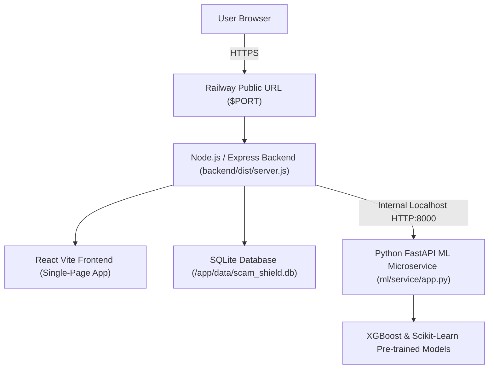

# Hosting Scam-Shield on Railway (railway.app) Guide

This guide details everything required to host the **Scam-Shield** platform on [Railway](https://railway.app) seamlessly.

---

## 🚀 Quick Start (1-Click Unified Container Deployment)

Scam-Shield is configured with a unified multi-stage container that runs **FastAPI ML Microservice**, **Node.js Express API**, and the **React Vite SPA** all together in a single Railway service. This ensures:
- Zero cross-service networking latency
- Free / Hobby tier friendliness (single dyno)
- Pre-trained XGBoost and NLP models work out of the box

### Step-by-Step Instructions:

1. **Push Changes to GitHub**:
   Ensure all changes in this repository are committed and pushed to your GitHub repository:
   ```bash
   git add .
   git commit -m "Configure Scam-Shield for Railway deployment"
   git push origin main
   ```

2. **Open Railway Dashboard**:
   - Go to [railway.app](https://railway.app/) and sign in with your GitHub account.
   - Click **"New Project"** -> **"Deploy from GitHub repo"**.
   - Select your repository: `Adarshsingh251/Scam-Shield`.

3. **Configure Environment Variables**:
   In Railway, navigate to your service's **"Variables"** tab and add:

   | Variable | Recommended Value | Description |
   |---|---|---|
   | `NODE_ENV` | `production` | Production environment flag |
   | `PORT` | `5000` *(Default dynamically assigned by Railway)* | The public listening port |
   | `JWT_SECRET` | *Generate a strong 32+ char random string* | Secret for auth tokens |
   | `JWT_EXPIRES_IN` | `7d` | Token expiry duration |
   | `CORS_ORIGIN` | `*` | Allowed CORS origins (or your custom domain) |
   | `DATABASE_PATH` | `/app/data/scam_shield.db` | Persistent SQLite path |
   | `ML_SERVICE_URL` | `http://127.0.0.1:8000` | Internal FastAPI service URL |

4. **Generate Public Domain**:
   - In Railway, click on your service -> **Settings** -> **Networking**.
   - Click **"Generate Domain"** (e.g., `scam-shield-production.up.railway.app`).

5. **Deploy & Verify**:
   - Railway will detect `railway.json` and `Dockerfile`, automatically build all assets, and launch `start.sh`.
   - Healthcheck URL: `https://<YOUR_RAILWAY_DOMAIN>/api/v1/health`
   - Frontend UI: `https://<YOUR_RAILWAY_DOMAIN>/`

---

## 🛠️ Architecture Breakdown in Railway



---

## 🧩 Alternative: Multi-Service Railway Deployment

If you prefer splitting the ML microservice and Backend into separate Railway services:

### 1. ML Microservice
- Create a service in Railway pointing to `Dockerfile.ml`.
- Add Railway Private Networking domain (e.g., `http://ml.railway.internal:8000`).

### 2. Backend & Frontend Service
- Create a service pointing to `Dockerfile.backend`.
- Set variable `ML_SERVICE_URL=http://ml.railway.internal:8000`.

---

## 🔍 Healthcheck & Verification Endpoints

Once deployed, you can verify your service status using curl or your browser:

1. **System Health**:
   ```bash
   curl https://<YOUR_RAILWAY_DOMAIN>/api/v1/health
   ```
   *Expected Response:*
   ```json
   {
     "status": "healthy",
     "timestamp": "...",
     "ml_service": { "status": "connected" },
     "database": { "status": "connected" }
   }
   ```

2. **Model Governance & Artifact Validation**:
   ```bash
   curl https://<YOUR_RAILWAY_DOMAIN>/api/v1/models
   ```
