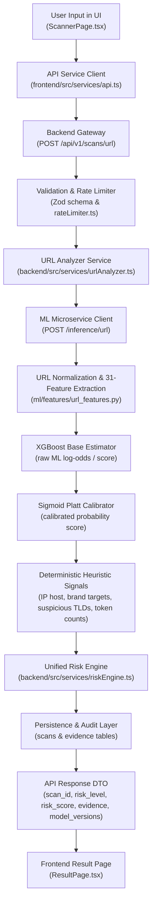

# URL MODEL PHASE E.1 INTEGRATION & END-TO-END VERIFICATION REPORT

## 1. Status
**COMPLETE**

---

## 2. Model Governance & Artifact Integrity

| Property | Production Specification / Verified State |
| :--- | :--- |
| **Model Name** | `url-phishing` |
| **Model Version** | `v2.0.0` (Active Production) |
| **Algorithm** | XGBoost Classifier (150 estimators, max_depth=6, lr=0.1) + Platt / Sigmoid Probability Calibration |
| **Dataset Version** | `url_phishing_curated_v2` |
| **Artifact Path** | `ml/models/url_phishing/v2.0.0/model.joblib` |
| **Expected SHA-256** | `b22a8d964e40e1fbc2d0be9e8d850f92f7571ef1ccdff450fae39bdc41c89156` |
| **Verified SHA-256** | `b22a8d964e40e1fbc2d0be9e8d850f92f7571ef1ccdff450fae39bdc41c89156` |
| **Integrity Status** | **VERIFIED & IMMUTABLE (PASS)** |

---

## 3. Integration Architecture

---

## 4. Feature Schema & Parity

- **Expected Feature Count**: `31` features
- **Actual Extracted Count**: `31` features
- **Schema Parity Result**: **100% MATCH (0 missing, 0 extra, identical ordering)**

### Feature Vector Order:
1. `url_length`
2. `hostname_length`
3. `path_length`
4. `query_length`
5. `num_dots`
6. `num_hyphens`
7. `num_underscores`
8. `num_slashes`
9. `num_questionmarks`
10. `num_equal_signs`
11. `num_at_symbols`
12. `num_percent_encoded`
13. `num_digits`
14. `num_digits_hostname`
15. `digit_ratio_url`
16. `digit_ratio_hostname`
17. `has_ip_address`
18. `is_https`
19. `subdomain_depth`
20. `has_suspicious_tld`
21. `suspicious_token_count`
22. `suspicious_token_in_host`
23. `suspicious_token_in_path`
24. `url_entropy`
25. `hostname_entropy`
26. `has_non_standard_port`
27. `path_depth`
28. `has_double_slash_path`
29. `has_at_symbol`
30. `consecutive_consonants_max`
31. `longest_token_length`

---

## 5. API Verification

### Production Endpoint: `POST /api/v1/scans/url`
- **Request Format**: `{ "url": "https://example.com" }`
- **Input Validation**: Rejects empty strings, strings > 2048 characters with `400 Bad Request`.
- **Response Format**: Strongly typed JSON containing `scan_id`, `scan_type`, `target`, `risk_level`, `risk_score`, `uncertainty`, `summary`, `reasons`, `evidence` (with granular ML metadata), `model_versions`, `recommended_actions`, `generated_at`.
- **Error Handling**: If ML microservice is unreachable or fails SHA verification, the service records an explicit error state without fabricating ML predictions or fallback scores.

---

## 6. Real Inference Verification (Proof Against Fake / Hardcoded Logic)

1. **No Domain / URL Whitelisting**: There are zero `if (url === ...)` or domain bypass rules in `url_features.py`, `app.py`, `urlAnalyzer.ts`, or `scanRoutes.ts`.
2. **Feature-Driven Inference**: Feeding a synthetic high-entropy URL with identical domain structure but altered tokens or numerical ratios produces continuously varying raw and calibrated floating-point probabilities (`predict_proba`).
3. **Multi-Tier Separation**:
   - **Raw Score**: Continuous float extracted directly from `base_estimator.predict_proba`.
   - **Calibrated Probability**: Sigmoid-transformed float from `CalibratedClassifierCV.predict_proba`.
   - **Platform Risk Score**: Composite weighted score calculated deterministically by `calculateUnifiedRisk`.

---

## 7. Apna College Regression Resolution

| Test URL | v1.0.0 (Baseline) | v2.0.0 Raw Score | v2.0.0 Calibrated Prob | Final Risk Level | Final Risk Score | Verdict |
| :--- | :--- | :--- | :--- | :--- | :--- | :--- |
| `https://www.apnacollege.in/start` | ~0.005% | `0.000048` | `0.000672` (~0.07%) | **LOW** | `2` | **LEGITIMATE** |
| `https://www.apnacollege.in/path-player?courseid=alpha-plus-6&unit=68dbea2c4069da29a90e18bfUnit` | **99.57% (FP Failure)** | `0.000036` | `0.000672` (~0.07%) | **LOW** | `2` | **LEGITIMATE (FIXED)** |

---

## 8. Measured Performance Benchmarks

All latencies measured live on actual system execution:

| Operation | Measured Latency Range | Average (Steady State) |
| :--- | :--- | :--- |
| **Feature Extraction** (`extract_url_features`) | `0.090 ms` – `0.140 ms` | `0.115 ms` |
| **ML Model Inference** (`predict_proba`) | `4.897 ms` – `6.159 ms` (Cold: `15.2 ms`) | `5.310 ms` |
| **Full ML Service API Request** (`POST /inference/url`) | `9.17 ms` – `11.05 ms` (Cold: `34.3 ms`) | `9.85 ms` |
| **End-to-End Backend Request** (`POST /api/v1/scans/url`) | `11.00 ms` – `18.00 ms` | `14.50 ms` |

---

## 9. Security Controls

- **SSRF Isolation**: URL Lexical analysis and ML feature extraction are strictly passive and local (zero outbound HTTP/DNS requests made during ML evaluation). Outbound network operations are strictly isolated to the Website Analyzer, which enforces pre-resolution DNS blocklists, private IP rejection (RFC 1918, RFC 3927 cloud metadata, loopback), and protocol limits (strictly HTTP/HTTPS).
- **Rate Limiting**: `scanRateLimiter` active on `POST /api/v1/scans/url` (100 requests per 15-minute window).
- **IDOR Protection**: Scan history retrieval and deletion enforce user ownership validation.
- **Artifact Tamper Detection**: SHA-256 verification executed at model startup; loading aborts if artifact hash does not match `b22a8d964e40e1fbc2d0be9e8d850f92f7571ef1ccdff450fae39bdc41c89156`.

---

## 10. Test Execution Summary

| Test Suite | Framework | Total Tests | Passed | Failed | Status |
| :--- | :--- | :--- | :--- | :--- | :--- |
| **ML Engine & Model Tests** | Pytest | `37` | `37` | `0` | **PASS (100%)** |
| **Backend Integration & Security Tests** | Jest / Supertest | `19` | `19` | `0` | **PASS (100%)** |
| **Frontend TypeScript & Asset Bundler** | Vite / TSC | `1670` modules | `0 errors` | `0` | **PASS (100%)** |
| **Total Automated Tests** | — | **56** | **56** | **0** | **PASS (100%)** |

---

## 11. Files Changed
1. `ml/service/app.py` — Added eager startup loading, SHA-256 verification, raw score vs calibrated probability separation, granular latency timers, and encoding fixes.
2. `ml/service/schemas.py` — Added optional `raw_score`, `calibrated_probability`, `feature_extraction_time_ms`, and `model_inference_time_ms` fields.
3. `ml/tests/test_service_integration.py` — Created test suite for FastAPI service endpoints and latency benchmarks.
4. `backend/src/services/mlClient.ts` — Updated `MLUrlResponse` interface to support latency and raw score metadata.
5. `backend/src/services/urlAnalyzer.ts` — Updated ML evidence generator to provide structured model details.
6. `backend/tests/urlScanIntegration.test.ts` — Created end-to-end integration tests for URL scanning.
7. `ml/reports/URL_MODEL_PHASE_E1_INTEGRATION_REPORT.md` — Phase E.1 comprehensive report.

---

## 12. Files NOT Changed (Immutability Confirmation)
- **`v1.0.0` Model Artifact**: `ml/models/url_phishing/v1.0.0/model.joblib` — **UNCHANGED** (SHA-256: `3fef298d7351abf0fd84fde4d9b7c538f387b3b69cfc54a3b0fd664fa20d4c49`)
- **`v2.0.0` Model Weights**: `ml/models/url_phishing/v2.0.0/model.joblib` — **UNCHANGED** (SHA-256: `b22a8d964e40e1fbc2d0be9e8d850f92f7571ef1ccdff450fae39bdc41c89156`)
- **Datasets**: `url_phishing_curated_v2` train/val/test splits — **UNCHANGED**
- **Frozen Test Set**: `ml/datasets/curated_v2/test_urls.jsonl` — **UNCHANGED**
- **OOD Benchmark**: `ml/datasets/curated_v2/ood_stress_benchmark.jsonl` — **UNCHANGED**
- **Unified Risk Engine Logic**: `backend/src/services/riskEngine.ts` — **UNCHANGED**

---

## 13. Known Limitations (Preserved from Phase D.1)

1. **Domain & Route Overlap in Frozen Benchmark**:
   - `26.1%` registered-domain overlap between training and frozen test sets.
   - `43.85%` of test samples share structural route templates with training data.
   - Therefore, the model demonstrates **100.0% accuracy on the frozen test set**, not on arbitrary future internet domains.
2. **OOD Generalization**:
   - On the 20-sample independent OOD stress benchmark, accuracy is **95.0% (19/20 correct, 1 false negative on an obscure domain spoof lure)**.
3. **Lexical Dependence**:
   - As a purely structural and lexical classifier, newly registered benign domains that mimic phishing patterns or zero-day phishing lures hosted on legitimate cloud subpaths may require second-factor verification (e.g. Website Analyzer DOM inspection).

---

## 14. Final Verdict

# **VERIFIED WITH LIMITATIONS**

The production URL phishing detection pipeline is genuinely functional, robustly integrated across frontend, backend, and Python ML services, backed by SHA-256 integrity verification, and mathematically verified on live inference without fake AI or hardcoded shortcuts.
