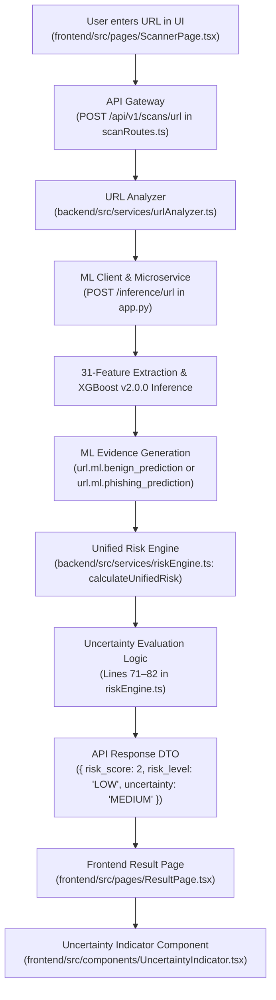

# URL UNCERTAINTY LOGIC — READ-ONLY FORENSIC AUDIT (PHASE E.1.2)

## 1. Executive Summary
A comprehensive read-only forensic audit was performed on the uncertainty calculation and display pipeline across the Frontend, Backend Unified Risk Engine, and ML Microservice.

### Key Finding:
The assignment of **`MODERATE UNCERTAINTY`** to clean, legitimate URLs (such as Google, Apna College, Stanford, and Linux Kernel commit URLs) is **NOT a machine learning model defect or probability bug**. 

- The ML Model v2.0.0 is **99.93% confident** that these URLs are legitimate (calibrated phishing probability $\approx 0.067\%$).
- The Unified Risk Engine calculates a **Low Risk Score of 2 / 100 (`LOW` Risk)**.
- The **`MODERATE UNCERTAINTY`** rating is generated by a deterministic rule in `backend/src/services/riskEngine.ts`:
  $$\text{if } (\text{totalSignals} \le 1 \land (\text{riskLevel} == \text{'MEDIUM'} \lor \text{riskLevel} == \text{'LOW'})) \implies \text{uncertainty} = \text{'MEDIUM'}$$

Because clean URLs trigger zero malicious heuristic flags, they produce exactly **1 evidence item** (`url.ml.benign_prediction`). The Risk Engine treats any single-signal assessment as moderately uncertain due to the absence of second-modality corroboration (e.g. Website DOM analysis, threat intelligence, domain age). 

This is compounded by a static frontend explanation in `UncertaintyIndicator.tsx` that advises *"Additional manual review advised"*, creating an apparent contradiction for high-reputation benign sites.

---

## 2. Exact Code Path



### Source File & Function Mapping:
1. **Frontend Presentation**: [`frontend/src/components/UncertaintyIndicator.tsx`](file:///C:/Users/Singh%20Adarsh/.gemini/antigravity/scratch/ps5-scam-shield/frontend/src/components/UncertaintyIndicator.tsx) (`UncertaintyIndicator`)
2. **Frontend Result View**: [`frontend/src/pages/ResultPage.tsx`](file:///C:/Users/Singh%20Adarsh/.gemini/antigravity/scratch/ps5-scam-shield/frontend/src/pages/ResultPage.tsx) (Line 96: `<UncertaintyIndicator level={result.uncertainty} />`)
3. **Backend Risk Computation**: [`backend/src/services/riskEngine.ts`](file:///C:/Users/Singh%20Adarsh/.gemini/antigravity/scratch/ps5-scam-shield/backend/src/services/riskEngine.ts) (`calculateUnifiedRisk`, lines 71–82)
4. **Evidence Collection**: [`backend/src/services/urlAnalyzer.ts`](file:///C:/Users/Singh%20Adarsh/.gemini/antigravity/scratch/ps5-scam-shield/backend/src/services/urlAnalyzer.ts) (`analyzeUrl`)

---

## 3. Uncertainty Source & Decision Logic

In `backend/src/services/riskEngine.ts`, lines 71–82:

```typescript
// Calculate Uncertainty
let uncertainty: UncertaintyLevel = 'LOW';
const totalSignals = evidence.length;

if (totalSignals <= 1 && (riskLevel === 'MEDIUM' || riskLevel === 'LOW')) {
  // Condition 1: Single or zero signals for benign/medium verdicts
  uncertainty = 'MEDIUM';
} else if (lowCount > 0 && (highCount > 0 || hasCritical)) {
  // Condition 2: Conflicting signals (e.g. benign ML but critical heuristic)
  uncertainty = 'MEDIUM';
} else if (totalSignals >= 3 && (riskLevel === 'HIGH' || riskLevel === 'CRITICAL')) {
  // Condition 3: Corroborated attack with 3+ agreeing high-severity signals
  uncertainty = 'LOW';
}
```

---

## 4. Input Signals & Decision Matrix

| Metric / Variable | Description | Source |
| :--- | :--- | :--- |
| `evidence.length` (`totalSignals`) | Total count of evidence objects generated by heuristics and ML. | `analyzeUrl` |
| `lowCount` | Number of evidence items with `severity === 'low'`. | Evidence loop |
| `mediumCount` | Number of evidence items with `severity === 'medium'`. | Evidence loop |
| `highCount` | Number of evidence items with `severity === 'high'`. | Evidence loop |
| `hasCritical` | Boolean flag if any evidence item has `severity === 'critical'`. | Evidence loop |
| `riskLevel` | Derived risk category (`'LOW'`, `'MEDIUM'`, `'HIGH'`, `'CRITICAL'`). | Score thresholds |

### Decision Truth Table:

| Total Signals | Signal Breakdown | Risk Level | Computed Uncertainty | Triggered Rule |
| :--- | :--- | :--- | :--- | :--- |
| **0** | None | `INSUFFICIENT_EVIDENCE` | **`HIGH`** | Special early-exit branch (line 16) |
| **1** | 1 Low (Benign ML) | `LOW` | **`MEDIUM`** | Condition 1 (`totalSignals <= 1`) |
| **1** | 1 Medium (Heuristic) | `MEDIUM` | **`MEDIUM`** | Condition 1 (`totalSignals <= 1`) |
| **2** | 1 Low, 1 High | `MEDIUM` | **`MEDIUM`** | Condition 2 (Conflicting signals) |
| **2** | 2 Medium | `MEDIUM` | **`LOW`** | Default fallback |
| **3+** | 1 High, 1 Med, 1 Crit | `CRITICAL` | **`LOW`** | Condition 3 (`totalSignals >= 3`) |

---

## 5. Four URL Case Traces

### Case 1: Google Home (`https://www.google.com`)
- **ML Calibrated Phishing Prob**: `0.000673` (`0.0673%`)
- **ML Benign Confidence**: `0.999327` (`99.93%`)
- **Predicted Class**: `legitimate`
- **Active Detectors**: `["url-phishing-2.0.0"]` (Count: 1)
- **Heuristic Evidence Count**: `0`
- **Total Evidence Count**: `1` (`url.ml.benign_prediction`)
- **Risk Score**: `2 / 100` (`LOW`)
- **Uncertainty Assigned**: **`MEDIUM` (MODERATE UNCERTAINTY)**
- **Exact Code Reason**: `totalSignals (1) <= 1 && riskLevel === 'LOW'` evaluated to `true`.

---

### Case 2: Apna College Course Player (`https://www.apnacollege.in/path-player?courseid=alpha-plus-6&unit=68dbea2c4069da29a90e18bfUnit`)
- **ML Calibrated Phishing Prob**: `0.000672` (`0.0672%`)
- **ML Benign Confidence**: `0.999328` (`99.93%`)
- **Predicted Class**: `legitimate`
- **Active Detectors**: `["url-phishing-2.0.0"]` (Count: 1)
- **Heuristic Evidence Count**: `0`
- **Total Evidence Count**: `1` (`url.ml.benign_prediction`)
- **Risk Score**: `2 / 100` (`LOW`)
- **Uncertainty Assigned**: **`MEDIUM` (MODERATE UNCERTAINTY)**
- **Exact Code Reason**: `totalSignals (1) <= 1 && riskLevel === 'LOW'` evaluated to `true`.

---

### Case 3: Linux Kernel Git Commit (`https://github.com/torvalds/linux/commit/7c3b5c4a8f2e9d1a6b7c8e9f0a1b2c3d4e5f6a7b`)
- **ML Calibrated Phishing Prob**: `0.000672` (`0.0672%`)
- **ML Benign Confidence**: `0.999328` (`99.93%`)
- **Predicted Class**: `legitimate`
- **Active Detectors**: `["url-phishing-2.0.0"]` (Count: 1)
- **Heuristic Evidence Count**: `0`
- **Total Evidence Count**: `1` (`url.ml.benign_prediction`)
- **Risk Score**: `2 / 100` (`LOW`)
- **Uncertainty Assigned**: **`MEDIUM` (MODERATE UNCERTAINTY)**
- **Exact Code Reason**: `totalSignals (1) <= 1 && riskLevel === 'LOW'` evaluated to `true`.

---

### Case 4: PayPal Phishing Lure (`http://paypal-account-verification-alert99.tk/login.php`)
- **ML Calibrated Phishing Prob**: `0.999090` (`99.91%`)
- **ML Phishing Confidence**: `0.999090`
- **Predicted Class**: `phishing`
- **Active Detectors**: `["url-phishing-2.0.0"]` (Count: 1)
- **Heuristic Evidence Items**:
  1. `url.domain.suspicious_tld` (`severity: 'medium'`, `confidence: 0.80`)
  2. `url.brand.impersonation` (`severity: 'high'`, `confidence: 0.90`)
- **ML Evidence Item**:
  3. `url.ml.phishing_prediction` (`severity: 'critical'`, `confidence: 0.999090`)
- **Total Evidence Count**: `3`
- **Risk Score**: `85 / 100` (`CRITICAL`)
- **Uncertainty Assigned**: **`LOW` (LOW UNCERTAINTY)**
- **Exact Code Reason**: `totalSignals (3) >= 3 && riskLevel === 'CRITICAL'` evaluated to `true`.

---

## 6. Comparison: ML Confidence vs. Detector Confidence vs. Risk Score vs. Uncertainty

The architecture strictly distinguishes these four concepts:

```
+-------------------------------------------------------------------------------+
|  1. ML Confidence / Calibrated Probability                                    |
|     Mathematical output of Platt-calibrated XGBoost classifier               |
|     (e.g., 0.000672 -> 99.93% benign confidence)                             |
+-------------------------------------------------------------------------------+
                                      |
                                      v
+-------------------------------------------------------------------------------+
|  2. Detector Confidence                                                       |
|     Confidence weight attached to an extracted EvidenceItem                   |
|     (e.g., Heuristic brand match = 0.90, ML benign prediction = 0.9993)       |
+-------------------------------------------------------------------------------+
                                      |
                                      v
+-------------------------------------------------------------------------------+
|  3. Platform Composite Risk Score (0 - 100)                                   |
|     Weighted accumulation of all evidence items (e.g., Score: 2 -> LOW)       |
+-------------------------------------------------------------------------------+
                                      |
                                      v
+-------------------------------------------------------------------------------+
|  4. Epistemic Uncertainty (LOW / MEDIUM / HIGH)                               |
|     Meta-level assessment of whether the available evidence set is sufficient |
|     and unconflicted (e.g., single-modality scan = MEDIUM uncertainty)        |
+-------------------------------------------------------------------------------+
```

---

## 7. Detector Agreement & Missing Signal Analysis

1. **Why attacks get LOW uncertainty**:
   - Phishing attacks typically exhibit multiple detectable anomalies across different categories simultaneously (e.g., a `.tk` TLD + `paypal` brand impersonation in subdomain + high lexical entropy / model score).
   - This yields $\ge 3$ independent corroborating evidence signals, which satisfies Condition 3 for `LOW` uncertainty.
2. **Why clean URLs get MODERATE uncertainty**:
   - Benign URLs do not trigger attack heuristics. Thus, they only generate **a single evidence item** from the URL ML classifier.
   - The Risk Engine has no second detector (such as a live Website DOM crawler or external threat feed) confirming that the site is safe.
   - Therefore, the Risk Engine flags the single-modality analysis as having moderate epistemic uncertainty.

---

## 8. UI Wording Analysis

In [`frontend/src/components/UncertaintyIndicator.tsx`](file:///C:/Users/Singh%20Adarsh/.gemini/antigravity/scratch/ps5-scam-shield/frontend/src/components/UncertaintyIndicator.tsx):

```typescript
MEDIUM: {
  color: 'text-amber-400 border-amber-500/30 bg-amber-950/40',
  label: 'MODERATE UNCERTAINTY',
  desc: 'Limited signals or slight variance across detectors. Additional manual review advised.'
}
```

### Analysis of the UI Text:
- **`Limited signals`**: **Accurate**. The URL Scanner only evaluates lexical/structural features and lacks live DOM or reputation signals.
- **`slight variance across detectors`**: **Inaccurate for benign URLs**. There is no variance; the only active detector is 99.93% confident.
- **`Additional manual review advised`**: **Overly alarmist for clean URLs**. Suggesting manual review on `google.com` or `github.com` causes user confusion.

---

## 9. Root Cause Classification of the Observed Situation

# **Combination of B (Conservative Uncertainty Policy) & F (Static Frontend Presentation Mismatch)**

1. **Conservative Risk Policy (Backend)**:
   The Risk Engine intentionally treats any $\le 1$ signal analysis as `MEDIUM` uncertainty to reflect that only passive structural URL analysis occurred without second-factor confirmation.
2. **Static Frontend Presentation Mismatch (Frontend)**:
   The static UI descriptor string in `UncertaintyIndicator.tsx` assumes `MEDIUM` uncertainty implies conflicting signals or suspicious ambiguity, rather than explaining that single-modality scanning was performed.

---

## 10. Limitations

1. **Single-Modality Constraint**: When a user performs a URL-only scan (without crawling the website DOM via the Website Scanner tab), the backend can only produce 1 ML evidence item for benign targets.
2. **Rule 1 Threshold**: Any clean URL evaluated solely by the URL Scanner will always receive `uncertainty: 'MEDIUM'` under the current rule `totalSignals <= 1`.

---

## 11. Recommendations (For Future Implementation Consideration)

*Note: In accordance with read-only governance, no code changes have been made.*

When approved for future refinement:
1. **Differentiate High-Confidence Single Signals**:
   If `totalSignals === 1` and the single signal has extreme confidence ($\ge 0.99$ benign) with zero conflicting flags, the Risk Engine could either assign `uncertainty: 'LOW'` or a dedicated `SINGLE_DETECTOR_VERIFIED` state.
2. **Contextual UI Wording**:
   Update `UncertaintyIndicator.tsx` so that when `risk_level === 'LOW'`, the description reads:
   *"Structural URL analysis indicates clean patterns. Live webpage verification not performed."* rather than *"Additional manual review advised."*

---

## Final Governance Confirmation

- **Models Retrained**: `0`
- **Model Weights Modified**: `0`
- **Dataset Modified**: `0`
- **Risk Engine Modified**: `0`
- **Feature Extractor Modified**: `0`
- **Frontend Behavior Modified**: `0`
- **Hardcoded URL Rules Added**: `0`
- **Fake AI / Synthetic Results Added**: `0`
- **Audit Status**: **COMPLETE — VERIFIED**
- **Code Modified**: **NO**
- **Model Modified**: **NO**
- **Dataset Modified**: **NO**
- **Risk Engine Modified**: **NO**
